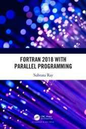
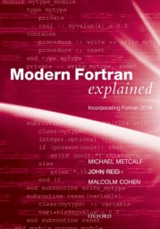
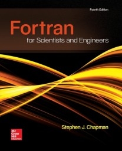
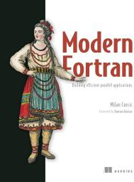

# Notes on Fortran

This repository contains my personal notes on subjects related to Fortran which I find interesting and write down over time. It is a work in progress and subject to constant change.

## About Fortran

Fortran is one of the first programming languages. Over time, it has been improved and updated. Today, it is considered a modern programming language, including support for:
* **Object-oriented programming:** Type extension and inheritance, polymorphism, dynamic type allocation, procedures linked to type.
* **Parallel programming:** Coarray, looping, array assignment, vectorization help, etc.

It is a productive, relatively small, high-level language that is easy to learn and use, allowing programmers to focus on the program's algorithm without worrying about too many technical details. Generally, it produces fast code, sometimes as fast as C, without the need to resort to low/medium-level languages.

**Interoperability:** Python/Numpy/[F2PY](https://numpy.org/doc/stable/f2py/) has good integration, allowing you to use Fortran in parts that require performance, combining the best of both worlds (Python's interactivity/prototyping with Fortran's speed).

**Usage:** Numerical prediction of climate and oceans, computational fluid dynamics, applied mathematics, statistics and finance, high-performance computing, and supercomputers.

---

## Language Standards

### Fortran 2023
* **Standard and documents:** <https://wg5-fortran.org/f2023.html>
* **Draft:** <https://j3-fortran.org/doc/year/21/21-007.pdf>
* **Book:** Modern FORTRAN Explained 6th ed. <https://www.amazon.com.br/Modern-Fortran-Explained-Incorporating-2023/dp/0198876580>
* **Compiler Support:** Intel compiler including some Fortran 2023 features. <https://www.intel.com/content/www/us/en/developer/articles/release-notes/oneapi-fortran-compiler-release-notes.html>
* **Summary of changes [J Reid]:** <https://fortran.bcs.org/2022/AGM22_Reid.pdf>
* **New features [J Reid]:** <https://wg5-fortran.org/N2201-N2250/N2212.pdf>

### Fortran 2018
*JTC1/SC22/WG5, Fortran 2018, ISO/IEC 1539:2018*

* **JTC1/SC22:** International standardization subcommittee. <http://wg5-fortran.org/f2018.html>
* **Specs:** <http://fortranwiki.org/fortran/show/Fortran+2018>
* **Examples:** <https://github.com/scivision/fortran2018-examples>
* **GNU Fortran Status:** <https://gcc.gnu.org/wiki/Fortran2018Status>
* **Interpretation Document:** <https://j3-fortran.org/doc/year/18/18-007r1.pdf>
* **TS 18508 (Parallel Features):** <http://isotc.iso.org/livelink/livelink?func=ll&objId=17288706&objAction=Open>

### Fortran 2008
Considering that F2018 is a small revision of F2008, most features are the same.
* **GNU Fortran Status:** <https://gcc.gnu.org/wiki/Fortran2008Status>
* **Specs:** <http://fortranwiki.org/fortran/show/Fortran+2008>

---

## Compilers & Toolchains

### Intel Fortran (oneAPI)
Intel oneAPI Toolkits are available at no cost.
* **ifort:** Intel Fortran Compiler Classic (Full 77, 90, 95, 2003, 2008, and 2018).
* **ifx:** Intel Fortran Compiler Beta (Full 77, 90, 95, and partial 2003). Uses LLVM back-end; supports **Intel Gen9 GPU** offloading.

**Resources:**
* [Free Intel Software Development Tools](https://software.intel.com/content/www/us/en/develop/articles/free-intel-software-developer-tools.html) (Intel ifort - full F2018).
* [Intel Fortran Compiler for oneAPI Release Notes](https://software.intel.com/content/www/us/en/develop/articles/intel-oneapi-fortran-compiler-release-notes.html).
* [Announcement on Fortran Discourse](https://fortran-lang.discourse.group/t/intel-releases-oneapi-toolkit-free-fortran-2018/471).
* [Installation Guide (Linux Package Managers)](https://software.intel.com/content/www/us/en/develop/documentation/installation-guide-for-intel-oneapi-toolkits-linux/top/installation/install-using-package-managers.html).
* [Puget Systems: Intro and Install](https://www.pugetsystems.com/labs/hpc/Intel-oneAPI-Developer-Tools----Introduction-and-Install-2054/).
* [Puget Systems: AI Analytics Toolkit with conda](https://www.pugetsystems.com/labs/hpc/Intel-oneAPI-AI-Analytics-Toolkit----Introduction-and-Install-with-conda-2068/).

### NVF (NVIDIA / PGI)
NVIDIA CUDA Fortran compiler and toolchain. Supports F2003, many F2008 features, CUDA, SIMD vectorization, OpenACC, and OpenMP for multicore x86-64, Arm, and OpenPOWER CPUs.
* **CUDA Fortran:** <https://developer.nvidia.com/cuda-fortran>
* **Programming Guide:** <https://docs.nvidia.com/hpc-sdk/compilers/cuda-fortran-prog-guide>

### F2PY
F2PY provides a connection between Python and F90 languages. It is not a replacement for F90, but a way to utilize the Python ecosystem without reinventing the wheel.
* **Documentation:** <https://numpy.org/doc/stable/f2py/>
* **Jupyter Example:** <https://gist.github.com/shane5ul/79340646ba0a4487c9da50b805215369>

---

## Repository Contents

### Jupyter Notebooks
Collection of interesting concepts and tests.
* **pointerassignment** [[ipynb](notebooks/pointerassignment.ipynb)|[html](notebooks/pointerassignment.md)] - What does `=>` mean in Fortran?
* **implicit** [[ipynb](notebooks/implicit.ipynb)|[html](notebooks/implicit.md)] - Fortran 2018 `implicit none (external | type)`.
* **csv** [[ipynb](notebooks/csv.ipynb)|[html](notebooks/csv.md)] - Example of using CSV files in Fortran.
* **flang-aarch64** [[ipynb](notebooks/flang-aarch64.ipynb)|[html](notebooks/flang-aarch64.md)] - Example of Flang compiler running on a smartphone (Snapdragon 617, ARMv8 Cortex-A53) using Termux.
* **fortran-assembly** [[ipynb](notebooks/fortran-assembly.ipynb)|[html](notebooks/fortran-assembly.md)] - Shows assembly code generated by gfortran.
* **small-executable** [[ipynb](notebooks/small-executable.ipynb)|[html](notebooks/small-executable.md)] - Exercises to understand executable creation.
* **snippets** [[ipynb](notebooks/snippets.ipynb)|[html](notebooks/snippets.md)] - Code snippets collected over time.

### Mirrored Courses & Files
* **F90 from University of Liverpool:** Mirrored files (originally from `ftp://ftp.liv.ac.uk/pub/`) on Fortran 90 and HPC.
    * [HPCpage](https://web.archive.org/web/20130120030653/http://www.liv.ac.uk/HPC/HPCpage.html)
    * [F90Course](http://github.com/efurlanm/fortran/tree/main/F90Course)
    * [HPFCourse](http://github.com/efurlanm/fortran/tree/main/HPFCourse)
    * [HPFFMatter](http://github.com/efurlanm/fortran/tree/main/HPFFMatter)
    * [HTMLHPFCourse](http://github.com/efurlanm/fortran/tree/main/HTMLHPFCourse) (Extracted from tar.gz)
* [IDRIS MPI Course](https://github.com/efurlanm/fortran/tree/main/IDRIS): Directory containing the [MPI course](http://www.idris.fr/formations/mpi/) with F90 examples.

### My Projects & Snippets
* [btree](https://github.com/efurlanm/fortran/tree/main/btree): My implementation of binary trees from the [Benchmarks Game](https://benchmarksgame-team.pages.debian.net/benchmarksgame/performance/binarytrees.html).
* [PARF](https://github.com/efurlanm/ml/tree/main/parf): My version of PARF (Parallel Random Forest) algorithm, MPI-enabled, compiled with Intel Fortran 2021.2.

### Personal Notes
* [The status of the storage association in the Fortran standard](notes/storage-association.md) - Notes related to the discussion at [FortranWiki](https://fortranwiki.org/fortran/show/equivalence+discussion).

---

## Learning Resources

### Selected Books
 
 
 

*(Click on the book picture to see more details)*

### Videos of Interest
* [The IBM 1401 compiles and runs FORTRAN II](https://youtu.be/uFQ3sajIdaM) - 1959 IBM mainframe. 63-pass compiler, 8k core.
* [FortranCon2020 [Keynote]: Fortran 2018...and Beyond](https://youtu.be/mn8QMp6J3R0) - Overview of F2018.
* [FortranCon2020 [SP]: Parallelization of a Legacy Software through Fortran 2018 Standard](https://youtu.be/ib4ZZ7xJwJk) - Case study by Cepel (Brazil).
* [First Experiences with Parallel Application Development in Fortran 2018](https://youtu.be/01-ez4v4YPc) - NCAR algorithms on 98,000 cores.
* [Modern Fortran by Example](https://www.youtube.com/user/hexafoil/videos) - Video tutorial series.

### Links of Interest (General)
* [Fortran 90 Course Notes (1997)](https://web.archive.org/web/20220814061655/https://www.personal.psu.edu/jhm/f90/lectures/quickref.html) - Dr. Mahaffy.
* [Putting Fortran's object-related features to practical use](https://en.wikipedia.org/wiki/User:RBaSc/draft_ftnoo) - RBaSc (unpublished draft). [Code Repository](https://github.com/reinh-bader/object_fortran).
* [Programming in Modern Fortran](https://cyber.dabamos.de/programming/modernfortran/) - Intro to F2003/2008/2018/2023 on Unix.
* [FortRun bookmarks](https://github.com/FortRun/resources/).
* [Listing of open source and commercial compilers](https://fortran-lang.org/compilers/) - by fortran-lang.org.
* [BCS Fortran Specialist Group](https://fortran.bcs.org/) - Open forum.
* [WG5 ISO IEC Fortran Standards](https://wg5-fortran.org/).
* [US Fortran (J3)](https://j3-fortran.org) - Standards Technical Committee.
* [High Performance Fortran (HPF)](https://www.netlib.org/hpf/index.html) - Extensions to F90.
* [Tutorialspoint: Learn Fortran](https://www.tutorialspoint.com/fortran/).
* [Tutorialspoint: Online Fortran compiler](https://www.tutorialspoint.com/compile_fortran_online.php).
* [Fortran 90 Tutorial](https://pages.mtu.edu/~shene/COURSES/cs201/NOTES/fortran.html) - Dr. C.-K. Shene, Michigan Tech.
* [Clive Page's Fortran Resources](https://www.star.le.ac.uk/~cgp/fortran.html) - Univ. of Leicester.

### Links of Interest (Portuguese)
* [Curso de Fortran da UFV](https://www.ufv.br/gpiba/cursos/fortran/)
* [Programação em Fortran - UFPR](http://www.fisica.ufpr.br/kurak/fortran.html)
* [Introdução à Ciência da Computação - UFPR](https://www.inf.ufpr.br/ci208/notas/fortran.html)
* [Introdução à programação em Fortran 90 (USP/CAPES)](https://educapes.capes.gov.br/bitstream/capes/206100/2/Introdu%C3%A7%C3%A3o%20%C3%A0%20programa%C3%A7%C3%A3o%20em%20Fortran%2090.pdf) - Prof. Roland Köberle.
* [Apostila de Fortran - Física Computacional (UNESP)](http://wwwp.fc.unesp.br/~lavarda/fc1/apo/) - Prof. Francisco C. Lavarda.
* [Introdução ao Fortran 90 (UFPel)](https://wp.ufpel.edu.br/diehl/files/2016/09/f90_lec1.pdf) - Prof. Alexandre Diehl.
* [Material de Workshop - WorkEta (CPTEC/INPE)](http://www3.cptec.inpe.br/eta/wp-content/uploads/sites/6/2022/08/Material_Fortran-WorkEta-VII.pdf)
* [Notas Básicas de Fortran (USP Politécnica)](http://sites.poli.usp.br/p/valerio.almeida/images/Notas_Basicas_Fortran_ano_2015.pdf) - Prof. Valério Almeida.
* [Programação Fortran (UFC)](http://www.eq.ufc.br/MD_Fortran.pdf) - Engenharia Química.
* [Apostila de Fortran (UFF)](http://profs.ic.uff.br/~ilaim/fortran.pdf)
* [Apostila de Fortran 90 (CENAPAD-SP)](https://www.cenapad.unicamp.br/treinamentos/apostilas/apostila_fortran90.pdf)
* [Introdução à Programação com Fortran 90 (UFRGS)](https://lume.ufrgs.br/handle/10183/277510) - Prof. Jeferson J. Arenzon.
* [Introdução à programação estruturada em Fortran 90 (UFRGS)](https://lume.ufrgs.br/handle/10183/205103) - Prof. Rudnei Dias da Cunha.
* [Apostila de Fortran 90/95 (UFSJ)](https://ufsj.edu.br/portal2-repositorio/File/demat/PASTA-PROF/jorge/Fortran.pdf)
* [Fortran 95: Curso Básico](http.www.orengonline.com.br/fortran/apostila.htm) - Gilberto Orengo.
* [Cálculo Numérico com Fortran (UFRGS)](https://www.ufrgs.br/reamat/ComputacaoCientifica/livro/node7.html)
* [Álgebra Linear com Fortran (UNICAMP)](https.www.ime.unicamp.br/~marcia/AlgebraLinear/fortran.html)
* [Física Computacional - UNB](http://www.fis.unb.br/fal/index.php/aulas/)
* [Apostila de Fortran - PET Elétrica UFPR](https://pet.eletrica.ufpr.br/fortran/apostila_fortran.pdf)
* [Apostila de Fortran - IAG/USP](http://www.astro.iag.usp.br/~jane/aga215/apostila.pdf)
* [Fortran - ITA](https://www.ita.br/grad/engenharia-aeroespacial/disciplinas/)
* [Plugin gfortran para Code::Blocks](https://www.ufrgs.br/plugin-gfortran/)
* [Fortran Brasil (Tripod)](http://fortran.br.tripod.com/)
* [Física - UFBA](https://www.ppgfis.ufba.br/ped-281)
* [Física Computacional - UFRJ](https://www.if.ufrj.br/~joras/fc/)
* [Site da comunidade Fortran-lang](https://fortran-lang.org/pt/)
* [Página da Wikipedia Fortran](https://pt.wikipedia.org/wiki/Fortran)
* [Fortran 90 e 95 (Playlist)](https://www.youtube.com/playlist?list=PLHD-C-a_sul2dD-n_G-p-sS-p-o-j_b_A)
* [Física Computacional (Playlist)](https://www.youtube.com/playlist?list=PL2-b2-2G-o0-a8-mGe_g-p5o_g-a-j_b_)
* [Curso de Fortran - Boson Treinamentos](https://www.youtube.com/user/bosontreinamentos)
* [Curso de Fortran - Lucas Crispin](https://www.youtube.com/channel/UCa-iVmv-x3-n-a-tQ_3w_QQ)
* [Fortran (Playlist) - fcopt](https://www.youtube.com/playlist?list=PLX2gX-ftPVXW_Q_d-2-pY-nrVy2-Se_aI)
* [Fortran (Playlist) - Programação Descomplicada](https://www.youtube.com/watch?v=videoseries?list=PLOmdoKois7_FK-y3i0gNj7a2-X2G_a-8_)
* [Introdução ao Fortran (Vídeo)](https://www.youtube.com/watch?v=GMxI7s04s5w)
* [Fortran para Engenharia (Vídeo)](https://www.youtube.com/watch?v=QLoToA84s2A)
* [Fortran em 2023 (Vídeo)](https://www.youtube.com/watch?v=ulJaber_i4w)

---

## Miscellaneous
* **Hacker News:** [Use modern code/tools for glue, keep your climate models in FORTRAN](https://news.ycombinator.com/item?id=23847527).
* **Blog:** [Implicit None](https://web.archive.org/web/20160109190730/http://implicitnone.com/) - Ideas, suggestions, code hints & tips.

 Last edited: 2025-12-07 09:45:18
